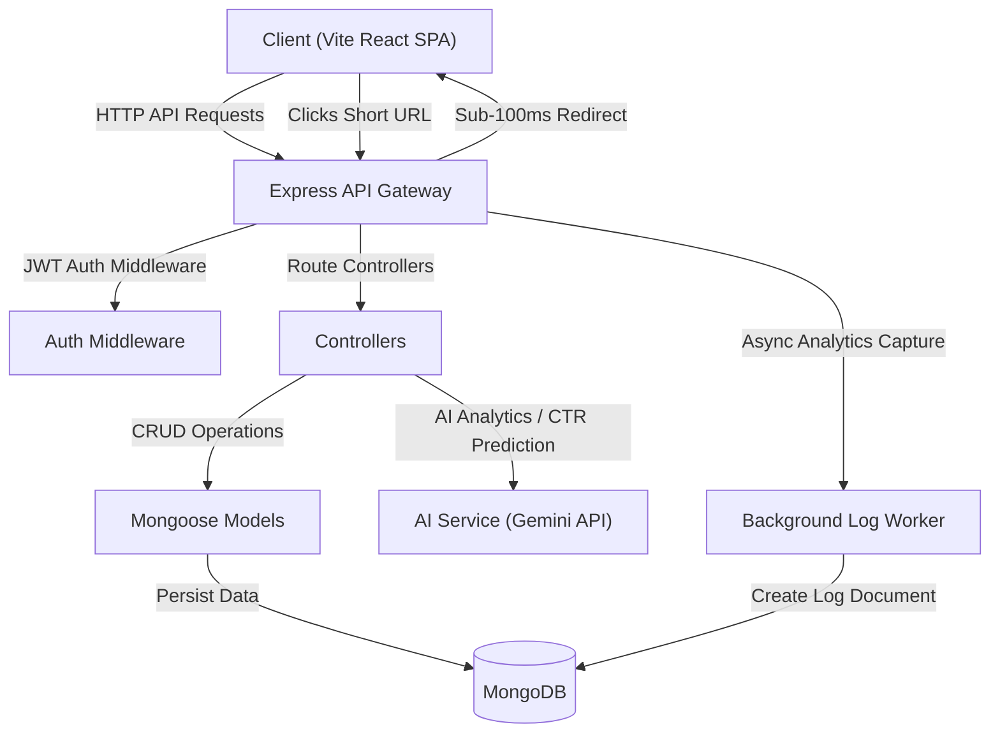

# 🔗 LinkEnhancer: AI-Powered URL Shortener & Analytics Suite

LinkEnhancer is a sleek, modern, enterprise-ready URL Shortener and click-telemetry analytics platform. Built with React (Vite SPA), Node.js, Express, and MongoDB, LinkEnhancer goes beyond standard code hashing by integrating Gemini AI to inspect links, predict CTR, and automate campaign tracking.

---

> [!NOTE]
> This project is a part of a hackathon run by [Katomaran Technologies](https://katomaran.com).

---

## 🏗️ Architecture Diagram



---

## ✨ Features

- **🚀 Sub-100ms Redirection**: Client browser requests resolve instantly, while click tracking, browser fingerprinting, and geo-IP lookup run asynchronously in non-blocking background tasks.
- **🛡️ AI Scam Detection**: Before shortening, LinkEnhancer dynamically evaluates destination URLs for phishing, malware, or suspicious scripting. Unsafe links are flagged, assigned a dynamic Risk Score, and served with custom warning pages.
- **📊 AI Audience Analytics**: Replaces plain click numbers with deep insights. Understand mobile-to-desktop user distributions, peak hour timeframes, and best performing days with actionable recommendation timing tips.
- **📁 AI Campaign Management**: Bundle multiple links together under distinct campaign folders (e.g. *"Summer Sale"*). The AI module aggregates traffic metrics across all links to identify your best/worst performing URLs and provides copy optimizations.
- **🎯 Engagement CTR Predictor**: Write title/description drafts and simulate platform postings (Twitter, LinkedIn) to forecast conversion scores and get recommendations.
- **🎨 Vector Branded QR Codes**: Instantly generate matching high-resolution QR codes featuring custom styled color palettes, complete with vector-ready downloading tools.
- **👤 Personalized Profile Dashboard**: View aggregated workspace statistics (Total Links, Total Clicks, Average Clicks / Link, and Workspace Safety Health) alongside a visual Doughnut chart representation of link traffic contribution, top-performing shortcodes lists, and a glassmorphic Pro Membership Ticket.

---

## 📂 Folder Structure

```
Katamaran TECH/
├── backend/                   # Node.js/Express REST API Server
│   ├── src/
│   │   ├── config/            # DB connectors & env configurations
│   │   ├── controllers/       # Route request controller handlers
│   │   ├── middlewares/       # JWT auth guards, rate limiters, error captures
│   │   ├── models/            # Mongoose schemas (User, Url, Analytics, Campaign)
│   │   ├── routes/            # REST API router files
│   │   ├── services/          # AI processing service & URL database helpers
│   │   ├── utils/             # Code generators & geo IP resolvers
│   │   └── validators/        # Express validation rules
│   ├── server.js              # Server entry point
│   └── package.json
│
├── frontend/                  # React Vite Client Workspace
│   ├── src/
│   │   ├── components/        # Shared UI layouts & custom forms
│   │   ├── contexts/          # Auth Context provider & JWT cookies manager
│   │   ├── pages/             # App pages (Home, Dashboard, Analytics, Campaigns)
│   │   ├── services/          # Axios HTTP instance with JWT interceptors
│   │   ├── theme.js           # Crimson- Midnight HSL glassmorphic design palette
│   │   ├── index.css          # Theme tokens & keyframe styles
│   │   ├── App.jsx            # Router switch board
│   │   └── main.jsx           # React app mount
│   ├── index.html
│   └── package.json
└── README.md
```

---

## 🔌 API Documentation

### 🔒 Authentication
- `POST /api/v1/auth/signup` - Register a new user.
- `POST /api/v1/auth/login` - Authenticate user credentials and return JWT bearer token.

### 🔗 Short Link Actions
- `POST /api/v1/urls` (Private) - Shorten a target destination link (supports custom alias/expiry schedules).
- `GET /api/v1/urls` (Private) - Fetch all shortened links created by the current user.
- `DELETE /api/v1/urls/:id` (Private) - Delete a shortcode and cascade delete all its analytics metrics.
- `GET /api/v1/urls/:id/qrcode` (Public) - Generates and returns a PNG buffer QR Code image.
- `POST /api/v1/urls/guest` (Public) - Anonymously shorten a link without an account.
- `POST /api/v1/urls/scan-safety` (Public) - Submit a link to test risk score before publishing.
- `POST /api/v1/urls/predict` (Public) - Calculate CTR engagement metrics for posts.

### 📁 Marketing Campaigns
- `POST /api/v1/campaigns` (Private) - Create a campaign and batch-shorten multiple links.
- `GET /api/v1/campaigns` (Private) - List campaigns created by the user.
- `GET /api/v1/campaigns/:id` (Private) - Get campaign clicks details and AI Optimization suggestions.
- `DELETE /api/v1/campaigns/:id` (Private) - Permanently delete a campaign.

---

## 🚀 Setup Instructions

### Prerequisites
- [Node.js](https://nodejs.org/) (v16.0.0 or higher)
- [MongoDB](https://www.mongodb.com/try/download/community) running locally or a MongoDB Atlas URI string
- [Gemini API Key](https://aistudio.google.com/) for AI insights and safety scanner

### 1. Backend Server Setup
1. Move to backend folder:
   ```bash
   cd backend
   ```
2. Setup environment settings:
   Create a `.env` file from the reference:
   ```env
   PORT=5000
   MONGODB_URI=mongodb://localhost:27017/url-shortener
   JWT_SECRET=yoursecretkeyhere
   JWT_EXPIRE=24h
   GEMINI_API_KEY=AIzaSy...your_gemini_key
   NODE_ENV=development
   ```
3. Run the development server:
   ```bash
   npm run dev
   ```

### 2. Frontend client Setup
1. Move to frontend folder:
   ```bash
   cd ../frontend
   ```
2. Start the Vite SPA client:
   ```bash
   npm run dev
   ```
3. Open the application:
   Vite client boots on [http://localhost:3000](http://localhost:3000).

---

## 📷 Screenshots Section

Below is a preview of the premium Midnight Dark glassmorphic interface:

| Dashboard Overview | Campaigns Tracking |
|---|---|
|  | *Detailed traffic metrics, custom branded shortlinks, and dynamic QR Codes dashboard views.* |

---

## 🌐 Deployment Links

- **Production Frontend UI**: *[Insert Frontend URL here]*
- **Production REST API Endpoint**: *[Insert Backend API URL here]*
